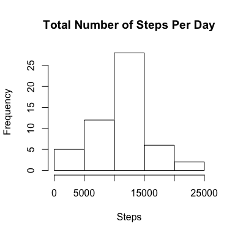
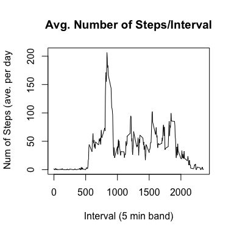
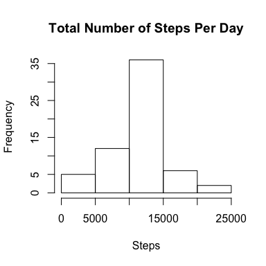
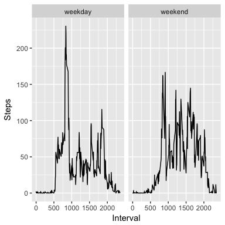

# Reproducible Research: Peer Assessment 1
David M.  


## Loading and preprocessing the data

The dataset consists of 17,568 observations of the number of steps taken in 5-minute intervals for each day. Additional information is provided in Appendix A.1.  There are 2304 rows with NA missing values for steps. For the purposes of the section 2, these observations will be excluded from the analysis. The date field was updated to a POSIXct format.


```r
activity <- read.csv("activity.csv", header = TRUE)
naActivity <- nrow(activity[!complete.cases(activity),])
activity$date <- as.POSIXct(strptime(activity$date, "%Y-%m-%d"))
activity2 <- na.omit(activity)
```


## What is mean total number of steps taken per day?
The number of steps per day was assesed and plotted on a histogram that shows normality of data.   

```r
library(dplyr)
agg <- aggregate(activity2$steps, by=list(activity2$date), FUN=sum)
names(agg) <- c("Day", "Total_Steps")
hist(agg$Total_Steps, main = "Total Number of Steps Per Day", xlab = "Steps")
```

<!-- -->

```r
meanSteps <- mean(agg$Total_Steps, na.rm = TRUE)
medianSteps <- median(agg$Total_Steps, na.rm = TRUE)
```
The median number of steps per day was 10765 and the mean number of steps was 10766.19.


## What is the average daily activity pattern?
A line plot showing the average number of steps taken for each time interval, averaged accross all days shows a large increase in activity around 13:00.

```r
agg2 <- aggregate(c(activity2$steps), by=list(activity2$interval), FUN=mean)
plot(agg2$Group.1,agg2$x, type = "l", xlab="Interval (5 min band)", ylab=" Num of Steps (ave. per day", main="Avg. Number of Steps/Interval")
```

<!-- -->

```r
maxStepsInterval <- agg2[agg2$x==max(agg2$x),]$Group.1
```
The interval with the highest number of steps, on avereage across all days in the dataset, was interval number 835.


## Imputing missing values
The number of missing data in the data set is 2304. In order to mitigate the potential effects of the missing data, the average number of steps taken for the same interval was used to replace the missing values.

```r
activity3 <- activity
for (j in which(is.na(activity3[, 1]))) {
        activity3[j, 1] <- mean(activity3[activity3[, "interval"] == activity3[j, "interval"], 1],  na.rm = TRUE)
}
agg3 <- aggregate(activity3$steps, by=list(activity3$date), FUN=sum)
names(agg3) <- c("Day", "Total_Steps")
hist(agg3$Total_Steps, main = "Total Number of Steps Per Day", xlab = "Steps")
```

<!-- -->

```r
meanSteps2 <- mean(agg3$Total_Steps)
medianSteps2 <- median(agg3$Total_Steps)
```
The median number of steps per day was 10766 and the mean number of steps was 10766.19. Inputting the missing data did not appear to make a significant difference on the estimates of the total daily number of steps.


## Are there differences in activity patterns between weekdays and weekends?
The activity between the weekend and the weekday was assessed and showed higher overall activity during the weekend. The weekday activity around 13:00 hours was higher during the weekday.

```r
library(lubridate)
library(ggplot2)
activity3$DayOfWeek <- as.factor(ifelse(wday(activity3[,2])>=2 & wday(activity3[,2]) <= 6, "weekday","weekend"))
agg4 <- aggregate(c(activity3$steps), by=list(activity3$interval, activity3$DayOfWeek), FUN=mean)
names(agg4) <- c("Interval", "DayOfWeek","Steps")
g <- ggplot(agg4, aes(x=Interval, y=Steps))
g <- g + geom_line() + facet_wrap(~DayOfWeek)
g
```

<!-- -->
